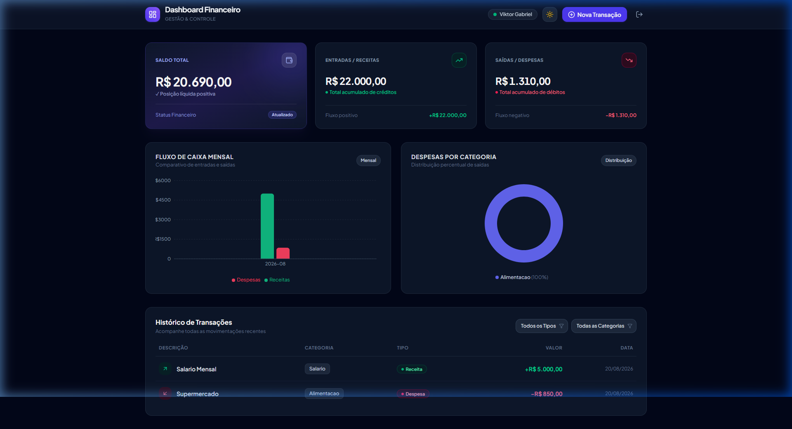
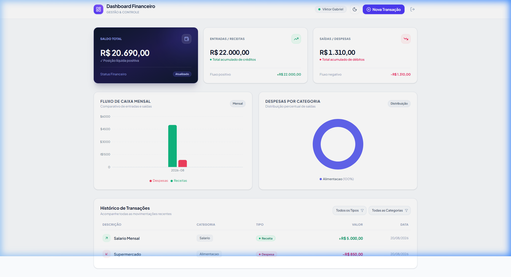
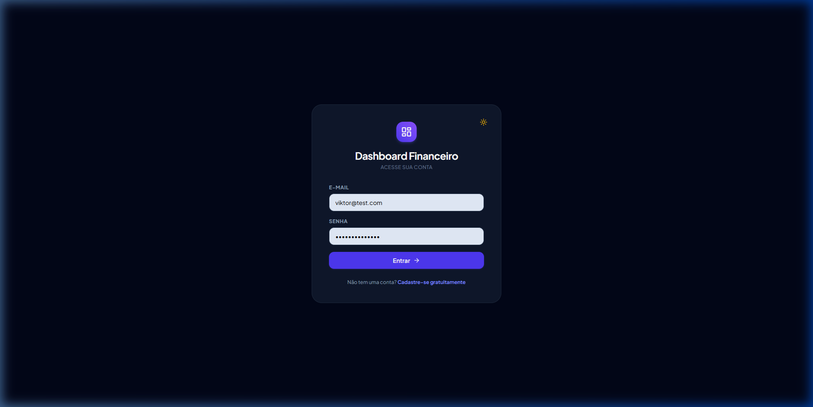
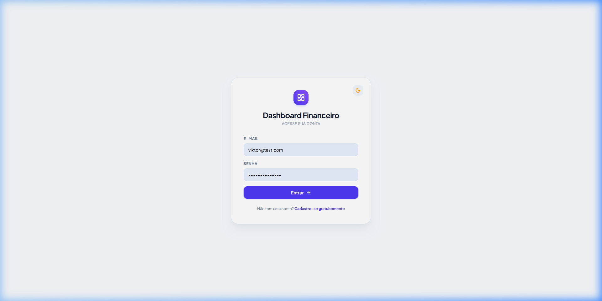
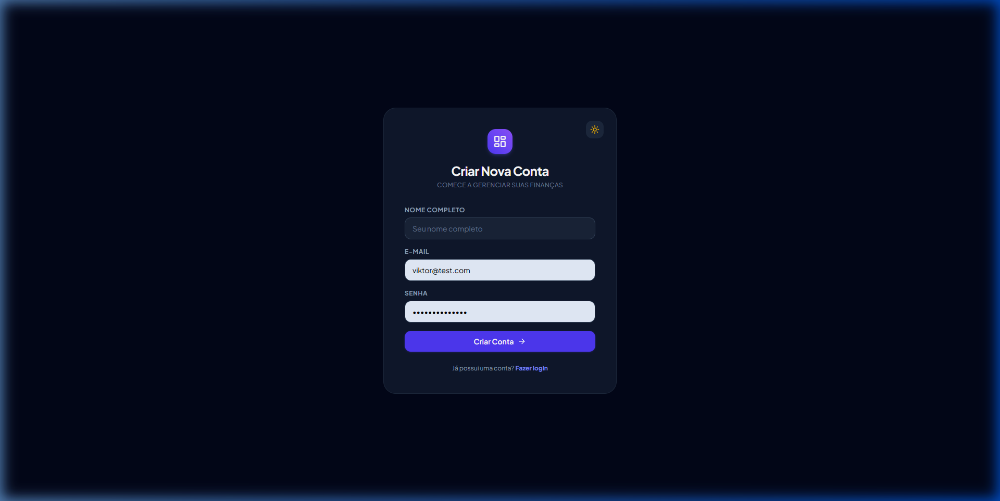
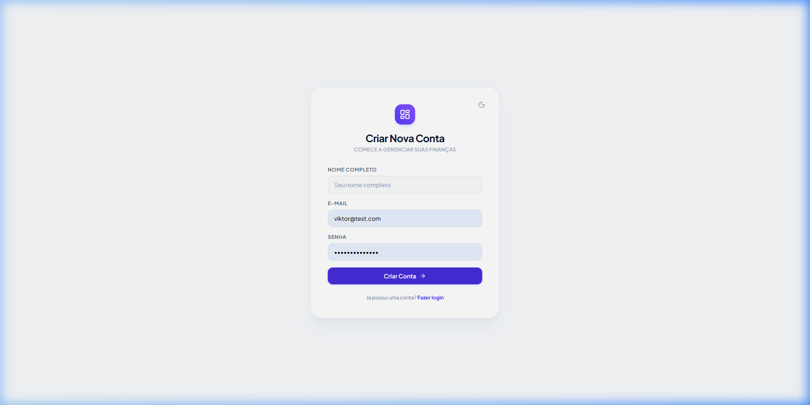

# 📊 Dashboard Financeiro - Fullstack Application

[](https://react.dev/)
[](https://vitejs.dev/)
[](https://tailwindcss.com/)
[](https://recharts.org/)
[](https://nodejs.org/)
[](https://www.typescriptlang.org/)
[](https://expressjs.com/)
[](https://www.prisma.io/)
[](https://www.sqlite.org/)
[](https://jwt.io/)
[](https://vitest.dev/)

Uma aplicação **Fullstack moderna e de alto padrão para gestão e inteligência financeira pessoal e empresarial**. O projeto combina uma interface com estética **Fintech Minimalista Premium** (inspirada em plataformas como *Stripe*, *Linear* e *Mercury*) com uma **API RESTful robusta** em Node.js construída sob os princípios de **Clean Architecture**, autenticação JWT, persistência com **Prisma ORM**, banco **SQLite** e gráficos interativos com **Recharts**.

---

## 📸 Demonstração Visual (Light & Dark Mode)

<div align="center">

### 🌟 Dashboard Principal — Modo Escuro (Dark Mode)


<br />

### ☀️ Dashboard Principal — Modo Claro (Light Mode)


<br />

### 🔐 Autenticação & Cadastro (Modo Escuro & Modo Claro)

<p align="center">
  <b>Login (Dark Mode)</b> &nbsp;&nbsp;&nbsp;&nbsp;&nbsp;&nbsp;&nbsp;&nbsp;&nbsp;&nbsp;&nbsp;&nbsp;&nbsp;&nbsp;&nbsp;&nbsp;&nbsp;&nbsp;&nbsp;&nbsp;&nbsp;&nbsp;&nbsp;&nbsp;&nbsp;&nbsp;&nbsp;&nbsp;&nbsp;&nbsp;&nbsp;&nbsp;&nbsp;&nbsp;&nbsp;&nbsp;&nbsp;&nbsp;&nbsp;&nbsp;&nbsp;&nbsp;&nbsp;&nbsp; <b>Login (Light Mode)</b>
  <br />
  
  &nbsp;
  
</p>

<p align="center">
  <b>Cadastro (Dark Mode)</b> &nbsp;&nbsp;&nbsp;&nbsp;&nbsp;&nbsp;&nbsp;&nbsp;&nbsp;&nbsp;&nbsp;&nbsp;&nbsp;&nbsp;&nbsp;&nbsp;&nbsp;&nbsp;&nbsp;&nbsp;&nbsp;&nbsp;&nbsp;&nbsp;&nbsp;&nbsp;&nbsp;&nbsp;&nbsp;&nbsp;&nbsp;&nbsp;&nbsp;&nbsp;&nbsp;&nbsp;&nbsp;&nbsp;&nbsp;&nbsp;&nbsp;&nbsp;&nbsp;&nbsp; <b>Cadastro (Light Mode)</b>
  <br />
  
  &nbsp;
  
</p>

</div>

---


## ✨ Principais Funcionalidades

### 💻 Frontend (React 19 + Vite + Tailwind CSS v4)
- **🎨 Design System Fintech Premium**:
  - **Elemento de Assinatura (*Signature Hero Card*)**: Card de saldo total em degradê escuro luminoso (`slate-900`/`indigo-950`), luz ambiente e números de alto contraste.
  - **Tipografia Moderna**: Família tipográfica **Plus Jakarta Sans** com suporte estrito a números tabulares (`tabular-nums`) para perfeito alinhamento contábil.
  - **Cabeçalho com Glassmorphism**: Barra superior translúcida com `backdrop-blur`, branding com gradiente índigo-violeta e indicador de usuário ativo em tempo real.
- **📊 Analytics & Gráficos Interativos**:
  - **Fluxo de Caixa Mensal (BarChart)**: Comparativo mês a mês de receitas vs despesas com cantos arredondados e *Custom Dark Tooltips*.
  - **Distribuição por Categorias (DonutChart)**: Percentual de saídas com paleta balanceada e legendas com cálculo percentual dinâmico.
- **💳 Tabela de Histórico de Transações**:
  - Filtros dinâmicos simultâneos por **Tipo** (Receitas/Despesas) e **Categoria**.
  - Linhas com espaçamento respirado, badges elegantes e microinterações táteis no hover.
- **➕ Modal de Nova Transação**:
  - Abertura suave com *backdrop-blur* e seletor segmentado moderno (*segmented controls*) entre Receita e Despesa.
- **🔐 Autenticação Completa**: Telas de Login e Cadastro com validação e persistência do token JWT no `localStorage`.

### ⚙️ Backend (Node.js + Express + Prisma)
- **🛡️ Segurança e Multi-usuário**: Hash seguro de senhas com **Bcryptjs**, autenticação stateless com **JWT** e isolamento estrito de dados por `userId`.
- **🗄️ Persistência Relacional**: Modelagem e migrações relacionais com **Prisma ORM** e adapter de alto desempenho **better-sqlite3**.
- **🎯 Regras de Negócio Isoladas**: Casos de uso (Use Cases) desacoplados da camada HTTP e de infraestrutura.
- **🌐 Suporte a CORS**: Integração nativa habilitada para comunicação segura com o frontend.
- **🧪 Testes Unitários**: Cobertura das regras de validação e cálculos com **Vitest**.

---

## 🚀 Tecnologias Utilizadas

### Frontend
- **[React 19](https://react.dev/)**: Biblioteca componentizada para interface de usuário reativa.
- **[Vite](https://vitejs.dev/)**: Bundler moderno e ambiente de desenvolvimento ultrarrápido.
- **[Tailwind CSS (v4)](https://tailwindcss.com/)**: Framework utilitário de alta performance.
- **[Recharts](https://recharts.org/)**: Visualização de dados declarativa e customizada.
- **[Lucide React](https://lucide.dev/)**: Ícones vetoriais elegantes e consistentes.
- **[Axios](https://axios-http.com/)**: Cliente HTTP com interceptors automáticos de Bearer Token.

### Backend
- **[Node.js](https://nodejs.org/)** & **[TypeScript](https://www.typescriptlang.org/)**: Runtime e tipagem estática ponta a ponta.
- **[Express](https://expressjs.com/)**: Framework web para roteamento e middlewares.
- **[Prisma ORM](https://www.prisma.io/)**: Mapeamento objeto-relacional tipado e migrações.
- **[SQLite](https://www.sqlite.org/) & [Better-SQLite3](https://github.com/WiseLibs/better-sqlite3)**: Banco de dados relacional leve e performático.
- **[Bcryptjs](https://github.com/dcodeIO/bcrypt.js)**: Criptografia e hashing seguro de senhas.
- **[JSON Web Tokens (JWT)](https://jwt.io/)**: Emissão e validação de tokens de acesso.
- **[CORS](https://github.com/expressjs/cors)**: Middleware para Cross-Origin Resource Sharing.
- **[Vitest](https://vitest.dev/)**: Testes unitários com feedback instantâneo.

---

## 📋 Pré-requisitos

Certifique-se de ter instalado em sua máquina:

- **[Node.js](https://nodejs.org/)** (`v18.x` ou superior, recomendado `v20.x` LTS)
- **[npm](https://www.npmjs.com/)** ou **[pnpm](https://pnpm.io/)** / **[yarn](https://yarnpkg.com/)**
- **[Git](https://git-scm.com/)**

---

## 🔧 Instalação e Execução

### 1. Clonar o repositório

```bash
git clone https://github.com/ViktorGabriel/dashboard-financeiro.git
cd dashboard-financeiro
```

---

### 2. Configurar e Iniciar o Backend

#### a) Instalar as dependências do backend:
```bash
npm install
```

#### b) Configurar as variáveis de ambiente:
Crie um arquivo `.env` na raiz do projeto:
```env
PORT=3000
DATABASE_URL="file:./dev.db"
JWT_SECRET="sua_chave_secreta_jwt_super_segura"
```

#### c) Executar as migrações do banco de dados:
```bash
npx prisma migrate dev
```

#### d) Iniciar o servidor backend:
```bash
# Modo desenvolvimento com hot-reload:
npm run start:watch

# Ou modo desenvolvimento padrão:
npm run start:dev
```
> O backend iniciará em: `http://localhost:3000`

---

### 3. Configurar e Iniciar o Frontend

Abra um **novo terminal** na pasta do projeto:

```bash
cd frontend
npm install
npm run dev
```
> O frontend iniciará em: `http://localhost:5173`

---

### 4. Executar os Testes Unitários

No terminal da raiz do projeto:

```bash
npx vitest run
```

---

## 📁 Estrutura do Projeto

```text
dashboard-financeiro/
├── docs/                               # Documentação e capturas de tela
│   └── screenshots/                    # Imagens do Dashboard e Auth
│       ├── dashboard-preview.jpg
│       └── login-preview.jpg
│
├── prisma/
│   ├── migrations/                     # Histórico de migrações SQL do banco
│   └── schema.prisma                   # Modelos de dados (User, Transaction)
│
├── src/                                # BACKEND (API Express)
│   ├── domain/                         # Entidades, DTOs e Interfaces de Domínio
│   │   ├── analytics.ts                # Contratos de CashFlowPoint e CategoryBreakdown
│   │   ├── transaction.ts              # Entidade Transaction e DTOs de filtro e criação
│   │   └── user.ts                     # Entidade User e DTOs de autenticação
│   ├── middlewares/                    # Interceptadores Express
│   │   └── ensure-authenticated.ts     # Validação de token Bearer JWT e injeção de userId
│   ├── repositories/                   # Abstração de Acesso a Dados
│   │   ├── i-transaction-repository.ts
│   │   ├── transaction-repository.ts
│   │   ├── in-memory-transaction-repository.ts # Repositório mock para testes unitários
│   │   ├── prisma-transaction-repository.ts    # Repositório persistido com Prisma ORM
│   │   ├── i-user-repository.ts
│   │   └── prisma-user-repository.ts
│   ├── use-cases/                      # Regras de Negócio da Aplicação
│   │   ├── authenticate-user.ts        # Validação de credenciais e geração de JWT
│   │   ├── create-transaction.ts       # Validações financeiras e criação de transação
│   │   ├── get-cash-flow.ts            # Agrupamento temporal do fluxo de caixa mensal
│   │   ├── get-category-breakdown.ts   # Cálculo percentual e ordenação por categoria
│   │   ├── get-summary.ts              # Totalizador consolidado (receitas, despesas, saldo)
│   │   └── register-user.ts            # Registro de usuário com hashing bcrypt
│   ├── tests/                          # Testes unitários
│   │   └── get-summary.spec.ts
│   └── server.ts                       # Setup do Express, middlewares, CORS e rotas
│
├── frontend/                           # FRONTEND (React SPA + Vite)
│   ├── src/
│   │   ├── components/                 # Componentes Visuais do Dashboard
│   │   │   ├── Header.tsx              # Barra de navegação com glassmorphism e ações
│   │   │   ├── SummaryCards.tsx        # Signature Hero Card e Cards de Apoio
│   │   │   ├── CashFlowChart.tsx       # Gráfico de barras com Tooltip Dark Customizado
│   │   │   ├── CategoryPieChart.tsx    # Gráfico Donut de categorias com Recharts
│   │   │   ├── TransactionTable.tsx    # Tabela de extrato com filtros interativos
│   │   │   └── NewTransactionModal.tsx # Modal com segmented control e backdrop-blur
│   │   ├── contexts/
│   │   │   └── AuthContext.tsx         # Gerenciamento de estado de login, user e token
│   │   ├── pages/
│   │   │   ├── Login.tsx               # Tela de Login com nova identidade
│   │   │   └── Register.tsx            # Tela de Cadastro
│   │   ├── services/
│   │   │   └── api.ts                  # Instância Axios com interceptor de autenticação
│   │   ├── utils/
│   │   │   └── formatters.ts           # Formatadores de moeda (BRL) e datas (PT-BR)
│   │   ├── App.tsx                     # Layout principal e roteamento condicional
│   │   ├── index.css                   # Fontes (Plus Jakarta Sans), tabular-nums e Tailwind
│   │   └── main.tsx                    # Ponto de entrada React
│   ├── package.json
│   └── vite.config.ts
│
├── frontend_desing_skill.md            # Diretrizes de design e padrões visuais do projeto
├── package.json
├── tsconfig.json
└── README.md
```

---

## 📖 Documentação da API REST

> 💡 **Nota sobre valores:** Todos os valores monetários (`amount`, `incomes`, `expenses`, `balance`, `total`) são trafegados e salvos em **centavos** (ex: R$ 250,00 = `25000`) para garantir precisão decimal exata.

### 🔐 1. Autenticação (Rotas Públicas)

#### `POST /auth/register`
Cadastra um novo usuário no sistema.

**Request Body:**
```json
{
  "name": "Viktor Gabriel",
  "email": "viktor@example.com",
  "password": "senhaSegura123"
}
```

**Response (201 Created):**
```json
{
  "id": "c8a4d715-e01c-4b95-a226-5b4c1074a3f1",
  "name": "Viktor Gabriel",
  "email": "viktor@example.com",
  "createdAt": "2026-08-20T13:00:00.000Z"
}
```

---

#### `POST /auth/login`
Autentica o usuário e retorna o token JWT de acesso.

**Request Body:**
```json
{
  "email": "viktor@example.com",
  "password": "senhaSegura123"
}
```

**Response (200 OK):**
```json
{
  "user": {
    "id": "c8a4d715-e01c-4b95-a226-5b4c1074a3f1",
    "name": "Viktor Gabriel",
    "email": "viktor@example.com",
    "createdAt": "2026-08-20T13:00:00.000Z"
  },
  "token": "eyJhbGciOiJIUzI1NiIsInR5cCI6IkpXVCJ9..."
}
```

---

### 💳 2. Transações (Requer Header `Authorization: Bearer <TOKEN>`)

#### `POST /transactions`
Cadastra uma nova transação para o usuário logado.

**Request Body:**
```json
{
  "description": "Salário Mensal",
  "amount": 500000,
  "type": "INCOME",
  "category": "Salário"
}
```

**Response (201 Created):**
```json
{
  "id": "e8d64192-8022-4217-a068-07e155bcbf1e",
  "title": "Salário Mensal",
  "amount": 500000,
  "type": "INCOME",
  "category": "Salário",
  "userId": "c8a4d715-e01c-4b95-a226-5b4c1074a3f1",
  "createdAt": "2026-08-20T13:05:00.000Z"
}
```

---

#### `GET /transactions`
Lista as transações do usuário logado com suporte a filtros via query params:
- `?type=INCOME` ou `?type=EXPENSE`
- `?category=Alimentação`
- `?startDate=2026-08-01`
- `?endDate=2026-08-31`

**Exemplo de Requisição:**
```http
GET /transactions?type=EXPENSE&category=Supermercado
Authorization: Bearer <TOKEN>
```

**Response (200 OK):**
```json
[
  {
    "id": "006341a7-743d-48c0-a178-a2ae8c275996",
    "title": "Compras do Mês",
    "amount": 85000,
    "type": "EXPENSE",
    "category": "Supermercado",
    "userId": "c8a4d715-e01c-4b95-a226-5b4c1074a3f1",
    "createdAt": "2026-08-20T14:10:00.000Z"
  }
]
```

---

#### `GET /summary`
Retorna os totais consolidados de receitas, despesas e saldo do usuário.

**Response (200 OK):**
```json
{
  "incomes": 500000,
  "expenses": 85000,
  "balance": 415000
}
```

---

### 📈 3. Dashboard e Analytics (Requer Header `Authorization: Bearer <TOKEN>`)

#### `GET /dashboard/cash-flow`
Retorna dados agregados mês a mês para o gráfico de fluxo de caixa.

**Response (200 OK):**
```json
[
  {
    "period": "2026-07",
    "incomes": 480000,
    "expenses": 120000,
    "balance": 360000
  },
  {
    "period": "2026-08",
    "incomes": 500000,
    "expenses": 85000,
    "balance": 415000
  }
]
```

---

#### `GET /dashboard/categories`
Retorna a distribuição percentual de despesas por categoria, ordenada do maior gasto para o menor.

**Response (200 OK):**
```json
[
  {
    "category": "Supermercado",
    "total": 85000,
    "percentage": 56.7
  },
  {
    "category": "Transporte",
    "total": 45000,
    "percentage": 30.0
  },
  {
    "category": "Lazer",
    "total": 20000,
    "percentage": 13.3
  }
]
```

---

## 🤝 Como Contribuir

Contribuições são muito bem-vindas! Siga os passos abaixo:

1. Faça um **Fork** do projeto
2. Crie uma **Branch** para sua funcionalidade ou correção:
   ```bash
   git checkout -b feature/minha-nova-funcionalidade
   ```
3. Faça o commit de suas alterações seguindo o padrão [Conventional Commits](https://www.conventionalcommits.org/pt-br/):
   ```bash
   git commit -m "feat: adiciona exportacao de relatorio em CSV"
   ```
4. Envie sua branch para o repositório remoto:
   ```bash
   git push origin feature/minha-nova-funcionalidade
   ```
5. Abra um **Pull Request** detalhado

---

## 📄 Licença

Este projeto está sob a licença [ISC](LICENSE).

---

Feito com ☕ e código limpo por [Viktor Gabriel](https://github.com/ViktorGabriel).

